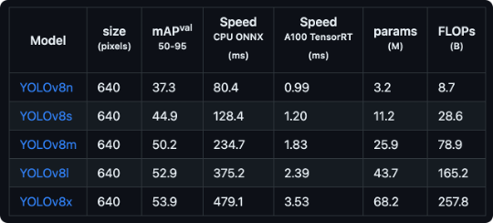
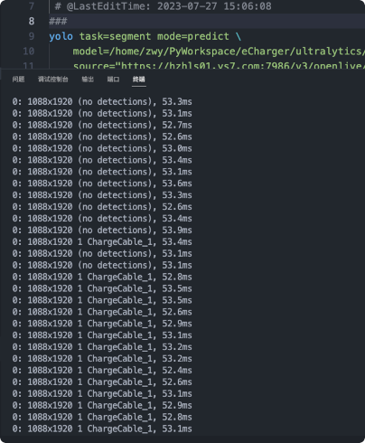
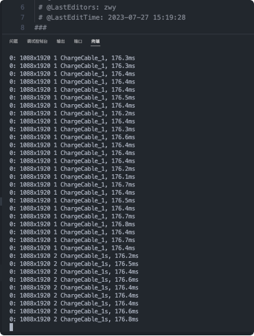
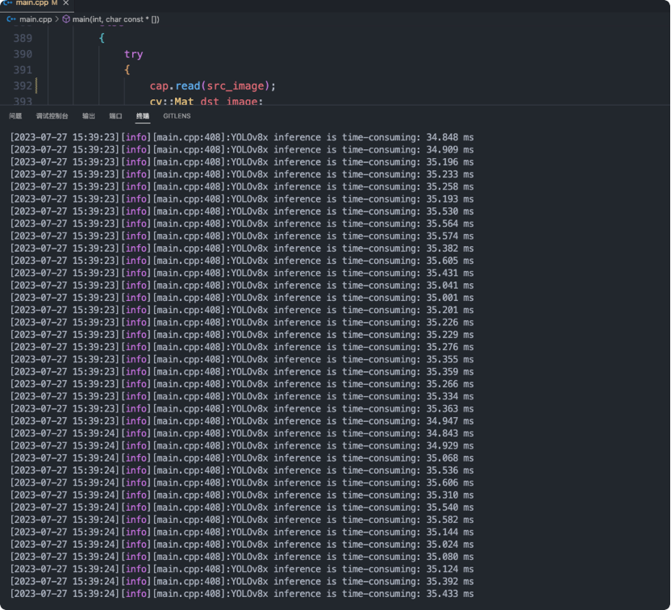
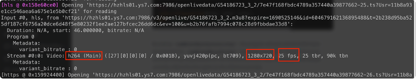
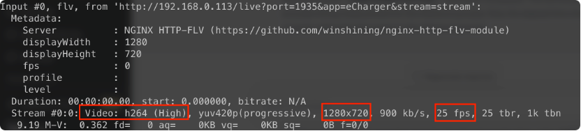
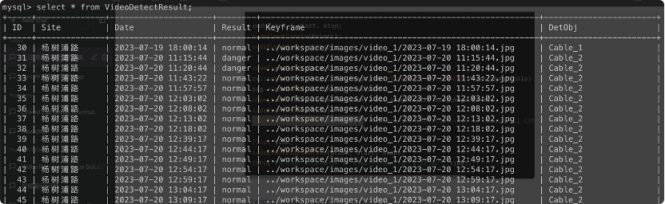
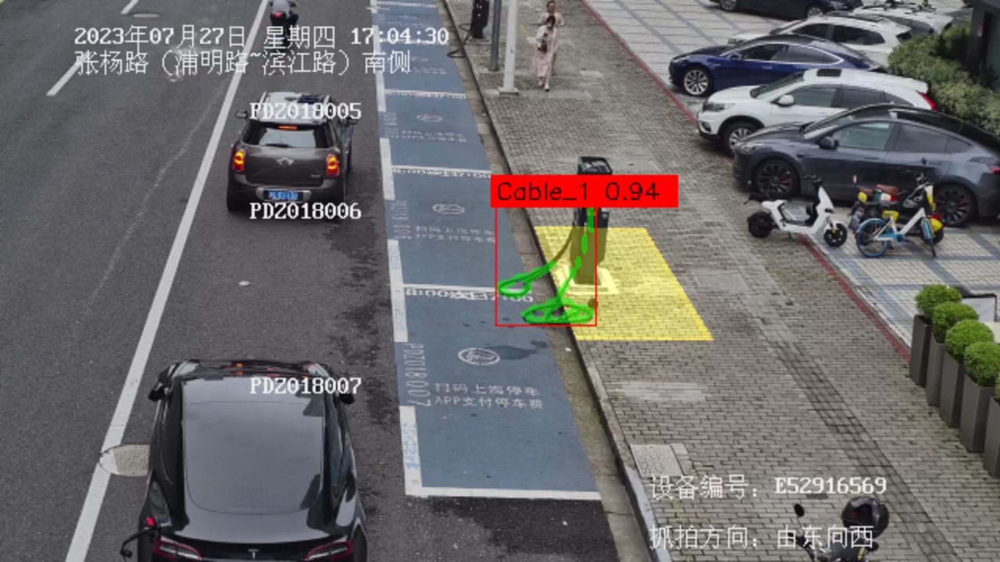

<!--
 * @description: 
 * @version: 
 * @Author: zwy
 * @Date: 2023-07-21 09:54:47
 * @LastEditors: zwy
 * @LastEditTime: 2023-08-03 13:54:58
-->
# TRT-YOLOv8-Seg
使用TensorRT加速YOLOv8-Seg，完整的后端框架，包括Http服务器，Mysql数据库，ffmpeg视频推流等。

- YOLOv8 实例分割
- TensorRT INT8量化 模型部署
- Http Sever 
- Mysql 数据库
- FFmpeg 推流

ffmpeg 3.3.9 

TensorRT 7.2.3.4 - 8.5

MySQL 8.0

OpenCV 4.5.5

## 一、YOLOv8 实例分割

[YOLOv8](https://github.com/ultralytics/ultralytics)  是一个 SOTA 模型，它建立在以前 YOLO 版本的成功基础上，并引入了新的功能和改进，以进一步提升性能和灵活性。具体创新包括一个新的骨干网络、一个新的 Ancher-Free 检测头和一个新的损失函数。

具体到 YOLOv8 算法，其核心特性和改动可以归结为如下：

1. **提供了一个全新的 SOTA 模型，包括 P5 640 和 P6 1280 分辨率的目标检测网络和基于 [YOLACT](https://link.zhihu.com/?target=https%3A//arxiv.org/abs/1904.02689) 的实例分割模型。和 YOLOv5 一样，基于缩放系数也提供了 N/S/M/L/X 尺度的不同大小模型，用于满足不同场景需求**
2. **骨干网络和 Neck 部分可能参考了 YOLOv7 ELAN 设计思想，将 YOLOv5 的 C3 结构换成了梯度流更丰富的 C2f 结构，并对不同尺度模型调整了不同的通道数，属于对模型结构精心微调，不再是无脑一套参数应用所有模型，大幅提升了模型性能。不过这个 C2f 模块中存在 Split 等操作对特定硬件部署没有之前那么友好了**
3. **Head 部分相比 YOLOv5 改动较大，换成了目前主流的解耦头结构，将分类和检测头分离，同时也从 Anchor-Based 换成了 Anchor-Free**
4. **Loss 计算方面采用了 TaskAlignedAssigner 正样本分配策略，并引入了 Distribution Focal Loss**
5. **训练的数据增强部分引入了 YOLOX 中的最后 10 epoch 关闭 Mosiac 增强的操作，可以有效地提升精度**

## 二、TensorRT 量化

YOLOv8-segment提供了五种不同的参数量的网络，分别是YOLOv8n，YOLOv8s, YOLOv8m, YOLOv8l，YOLOv8x。这五个网络参数量依次递增，检测精度依次递加，检测速度依次递减。下图是官网所给出的参数量、精度、检测速度的对比。

我们采用了YOLOv8n(最少参数量)和YOLOv8x(最大参数量)来测试模型，得到的实验结果如下：

  

    
    
YOLOv8n推理时间

  

  

    
    
YOLOv8x推理时间

  

由此可见，就算是模型参数量最少，推理速度最快的YOLOv8n模型推理单张图片也需要50ms以上，遑论YOLOv8x模型推理一张图片需要170ms以上。实时检测要求每秒25帧，也就是检测一张图片不能超过40ms。显然原生的YOLOv8-segment远远无法达到实时检测的效果。

在保证检测精度的前提下，我们为了进一步提高检测速度。首先，使用TensorRT的优化引擎对导出的模型进行优化， TensorRT会对模型进行各种优化，如层融合、内存优化和kernel优化，以加速模型的推理过程。将优化后的模型进行INT8量化。这一步将模型的权重和激活从浮点数转换为8位整数，从而减少模型的存储需求，并且CUDA 预处理加速输入数据处理，后处理优化模型输出。

在这一系列的优化下，我们成功将YOLOv8x模型的推理时间由原先的170ms缩短到35ms左右，达到了实时检测的要求。

## 三、检测结果的实时推流

 为了前端页面能够实时显示检测后的视频，我们需要将视频逐帧合并成视频推流成网络视频，这个过程为了尽可能保证视频的实时性，将实例分割和逐帧推流做成两个独立的线程，共享同一个资源池，当实例分割完成一张图片检测，推流线程就立刻推出。相互之间相对独立又共享资源。我们分析了原视频为H264编码，分辨为1280*720，帧率为25fps。为了达到更好的推流效果，我们推出的视频也采用相同规格。

## 四、检测结果的保存到数据库
我们的数据库中保存了监控的位置，检测时间，检测结果，关键照片保存路径，检测对象等信息。

- Site：表示监控所在位置。
- Date：表示关键帧照片的抓拍时间。
- Result：表示检测结果
- Keyframe：表示抓拍的关键帧照片。
- DetObj：表示检测的充电线。

## 五、HTTP-Server开发

为了前端页面能展示更多信息，我们设计了HTTP服务器，其主要作用是在计算机网络中提供Web服务，通过HTTP协议来传输数据，并向客户端（通常是Web浏览器）发送请求的响应。

HTTP服务器允许将Web页面、图像、视频、文本文件和其他资源提供给客户端。当用户在Web浏览器中输入URL或点击链接时，浏览器会向HTTP服务器发送请求，并从服务器接收响应，从而显示所请求的内容。

HTTP服务器可以与应用程序服务器（如PHP、Python、Node.js等）结合使用，用于生成动态内容。应用程序服务器在接收到HTTP请求后，可以根据请求参数和业务逻辑生成动态内容，并将其返回给HTTP服务器，再由HTTP服务器发送给客户端。

